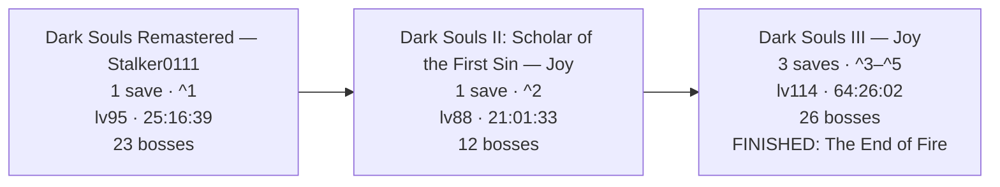

# sl2-analyzer

**Read a FromSoftware `.sl2` save and get back a plain report of the run: who the character is, what they are carrying, how far they actually got, and which Steam account the file belongs to. Seven games, browser or command line.**

A save file knows everything about your playthrough and tells you none of it. It is an encrypted binary blob. Open it in a text editor and you get noise. This turns that noise into something you can read.

What comes out is your name, level, every attribute, souls or runes held, play time, deaths, the full inventory with reinforcement and infusion written into the item names, which bonfires are lit and which you walked past, which bosses are dead, which covenants you found, which NPC handed you what, and which of the game's one-off world items you have picked up. All seven `.sl2` variants FromSoftware has shipped are supported: Dark Souls Prepare to Die Edition and Remastered, Dark Souls II in both releases, Dark Souls III, Elden Ring, and Sekiro. You never tell it which game it is looking at. It works that out from the bytes.

Two front ends run off one reading engine. Drop the file on [the web page](https://sl2-analyzer.darthdemono.com/) and each character is drawn as a replica of that game's own Level-Up screen. Or point the Python CLI at the file and get one Markdown document you can read, paste into a chat, or keep as a record, or JSON against a published schema if a program is doing the reading.

One rule decides every judgement call in the code: a wrong number is worse than a missing one. A field the tool cannot verify is left out, and the file says it was left out. Progress is a floor and never a ceiling. Everything listed is real. There may be more you have already done that the save can no longer prove.

Both front ends only ever read. Point either at your live save if you like. The worst case is a bad output file, not a bricked character.

There is a third way to use this repo and it has nothing to do with saves. The `db_*/` folders are a curated Souls data set: item ID tables for five game families, bonfire tables, boss-defeat flag tables, NPC questline flags, covenant flags, boss-soul-to-boss maps. Plain JSON, no dependency on the parser. If you are building a randomizer, a wiki scraper, a speedrun tool, a mod, or a Cheat Engine table and you only need "ID 7010900 is a Deep Battle Axe", take the folder and ignore the rest. It is MIT, same as the code. See [The data](#the-data-a-curated-souls-json-set).

The code lives at **https://github.com/darthdemono/sl2-analyzer**. Every Markdown file it writes carries the repo link and a one-line note on how that game was read, so a summary you pasted somewhere months ago still points back at the tool that made it.

---

## Quick start

**Use the web page.** Go to [sl2-analyzer.darthdemono.com](https://sl2-analyzer.darthdemono.com/), drag your `.sl2` onto it, done. If you would rather run it yourself, clone the repo and serve the folder:

```bash
python3 -m http.server 8000        # then open http://localhost:8000/
```

**Use the command line.** You need Python 3 and one library:

```bash
git clone https://github.com/darthdemono/sl2-analyzer
cd sl2-analyzer
pip install -r requirements.txt
python3 sl2_to_md.py "/path/to/DS30000.sl2" -o playthrough.md
```

Leave the path off entirely and it looks in the current folder plus the usual Steam, Proton, Heroic, Lutris and Windows save locations, then takes the most recently modified `.sl2` it finds. That is almost always your live character:

```bash
python3 sl2_to_md.py -o playthrough.md
```

**Point it at a folder of backups** and you get a history instead of a photograph, across characters and across games:

```bash
python3 sl2_to_md.py ~/saves/ -o history.md
```

Where the saves live, if the auto-detect misses: on Windows, `%APPDATA%` (`C:\Users\<you>\AppData\Roaming\<game>`). On Linux the game runs inside a Wine or Proton prefix and every launcher mirrors that same `AppData\Roaming\<game>` tree inside it, so you are always hunting the same tail, `.../pfx/drive_c/users/<user>/AppData/Roaming/<game>/*.sl2`:

- **Steam (Proton):** `~/.local/share/Steam/steamapps/compatdata/<appid>/pfx/drive_c/users/steamuser/AppData/Roaming/<game>`
- **Heroic (Epic / GOG):** `~/Games/Heroic/Prefixes/default/<Game>/pfx/drive_c/users/steamuser/AppData/Roaming/<game>` (older installs use `~/.config/heroic/prefixes/...`)
- **Lutris or plain Wine:** `~/.local/share/lutris/<game>/pfx/...` or `~/.wine/drive_c/users/<you>/AppData/Roaming/<game>`

Copy the `.sl2` out first if you would rather not touch the live folder. You do not have to.

---

## Supported games, and how far each one goes

Not every Souls save is mapped to the same depth in public tooling, so each game is handled at the highest tier it can be *trusted* at. A tier is a promise: everything printed at any tier is read from the save, never guessed.

| Game | Save file | Supported | Tier | What you get |
|---|---|:---:|---|---|
| Dark Souls: Prepare to Die Edition | `DRAKS0005.sl2` | Yes | **full** | identity, stats, souls, full inventory, deep progress |
| Dark Souls Remastered | `DRAKS0005.sl2` | Yes | **full** | identity, stats, souls, full inventory, deep progress |
| Dark Souls II: SOTFS | `DS2SOFS0000.sl2` | Yes | **full** | identity, stats, souls, full inventory, deep progress |
| Dark Souls II (vanilla) | `DARKSII0000.sl2` | Yes | **full** | identity, stats, souls, full inventory, deep progress |
| Dark Souls III | `DS30000.sl2` | Yes | **full** | identity, stats, souls, full inventory, deepest progress |
| Elden Ring | `ER0000.sl2` | Yes | **full\*** | identity, attributes, runes, remembrances, owned items (\*item list partial) |
| Sekiro: Shadows Die Twice | `S0000.sl2` | Yes | **full** | play time, journey, Sen, Attack Power, Vitality, max HP and Posture, every item carried and stored, bosses from Memories, Prayer Necklaces used |

Vanilla Dark Souls II used to be the one wall, because the Scholar key does not decrypt it and I could not find its own key anywhere. It turned out to be published after all, in TKGP's SoulsFormats (`SFUtil.GetDS2SaveKey`). Everything else about the two releases is identical, same BND4 layout, same field offsets, same item IDs, so once the right key goes in, vanilla reads exactly as deep as Scholar does. The two are told apart automatically by which key decrypts the block.

**Sekiro is the odd one out and it is the odd one out in the tool's favour.** Nothing is encrypted, nothing moves between patches, and a prosthetic tool's upgrade tier is a separate item ID, so there is no `+N` arithmetic to get wrong. It also has no character name, no attributes and no levelling, because the game has none of them, so none appear and the report says so rather than printing a blank. What it *does* have is the one trick nothing else here can do: **Attack Power goes up by exactly one per Memory consumed**, so `attack - 1` counts the boss tokens already spent. Every other game in this repo goes blind the moment you consume a soul. This one does not. **Vitality works the same way for Prayer Necklaces** — four beads make a necklace, the necklace is consumed, and Vitality is the only thing left that remembers it happened, so `vitality - 1` is how many you have used.

The asterisk on Elden Ring is honest too. Identity, every attribute, runes held, and remembrances are read straight from the save. The item *list* is partial, and the reason is narrower than it used to be: the tables now cover Shadow of the Erdtree, and a reinforced or affinity weapon resolves to its own row with the `+N` on it. What is missing is the **held inventory**. Owned items come from the GaItem array, which carries weapons, armour and Ashes of War only, so talismans, spells and consumables never appear and per-item quantities are not read. What is listed is really owned. It is just not the complete stash.

### Field by field

What each game actually surfaces. A `no` means the field is not readable from that game's save with anything published today, so it is omitted rather than faked.

| | DS1 (PtDE / DSR) | DS2 (both releases) | DS3 | Elden Ring | Sekiro |
|---|:---:|:---:|:---:|:---:|:---:|
| Name, level, attributes | yes | yes | yes | yes | the game has none |
| Souls / runes held | yes | yes | yes | yes | yes (Sen) |
| Soul Memory | no | yes | no | no | no |
| Max HP | yes | yes | yes | yes | yes |
| Max FP | no | no | yes | no | no |
| Stamina | yes | derived | yes | no | max Posture instead |
| Derived stats | equip load, attunement slots | full panel, verified byte-exact | slots, equip load, item discovery | no | no |
| Starting class | yes | yes | no | no | no |
| Gender | yes | yes | no | no | no |
| Covenant worn | no | yes | yes | no | no |
| Covenants found + rank | no | yes (rank 0 to 3) | yes (join + rank rewards) | no | no |
| Play time | yes | yes | yes | no | yes |
| Deaths | yes | yes | no | no | no |
| Hollowing | humanity | yes | embered flag | no | no |
| Playthrough (NG+) | DSR only | yes | yes | no | yes |
| Inventory, named | yes | yes, with `+N` and infusion | yes | partial | yes, incl. key items and the storage box |
| Equipped gear | no | no | weapons, armour, rings, ammo | no | no |
| Bonfires | 43, named, with kindle level | 77, named, by area | 77, named, by area | no | idols not read (region unmapped) |
| Boss defeats by flag | 12 | 6 | 25 + 26 victory flags | no | no (region unmapped) |
| Boss defeats by held soul | yes | yes | yes | yes | yes (Memories) |
| Boss defeats after the token is **spent** | no | no | no | no | **yes, from Attack Power** |
| Boss defeats by gate / NG+ | yes | yes | yes | gate only | no |
| Which missing boss is reachable now | yes, from the route graph | no | yes, from the route graph | no | no |
| NPC questline rewards | no | no | 57 NPCs, 101 rewards | no | no |
| World items picked up | no | no | 937, named, in 14 areas | no | no |
| Cinders of a Lord placed | no | no | count always, 3 of 4 named | no | no |
| Owning Steam account | no | no | yes | yes | yes |
| Folder the game demands | no | no | yes (hex) | not verified | yes (decimal) |

---

## Which account owns the save

Three of these games write the Steam account into the save, and then refuse to load a save that does not match. Change your account ID and your old characters vanish, with the game offering no explanation. That is worth being able to check, so the tool reads it.

```
- **Steam account:** 1070150501  _(SteamID64 76561199030416229 — the account this save was written by)_
- **Save folder:** `011000013fc93365`  _(the game loads this save only from a folder of this name)_
```

Both lines sit in the closing block of the report, beside the save-format version, because they are properties of the file rather than of any character. Run the CLI on a save that is sitting in the wrong account's folder and it also says so on stderr, naming both accounts.

**Who stores what:**

| Game | Account in the save | Save folder is named |
|---|---|---|
| Dark Souls III | yes, menu block `+0x04` | hex: `011000013fc93365` |
| Sekiro | yes, menu block `+0x24` | decimal: `76561199030416229` |
| Elden Ring | yes, menu block `+0x04` | not checked here, so not claimed |
| Dark Souls II (both) | **no** | hex, but nothing in the file to derive it from |
| Dark Souls 1 (both) | **no** | no account folder |

DS1 and DS2 are a real absence, not a gap in the reading. An exact byte search for both the full SteamID64 and the bare account ID, across saves whose owning account is known from the folder they live in, finds neither anywhere in the file. Those two games pick the folder from whoever is logged in and never write it down, which is also why their saves move between accounts and the other three do not.

**The Steam username is not in the save.** Not in DS3, not in Sekiro, not in Elden Ring. I went looking for it properly, since it would be the friendlier thing to print: a case-insensitive hunt for the two names I could verify, in ASCII and UTF-16, over every entry of every save in both encrypted and decrypted form, returns nothing at all. The name you see on a repack ("DODI" and the like) comes from the Steam emulator's own config in the game's install folder, not from anything the game wrote. So the account **number** is what gets printed, because it is what is actually there.

That number is enough for the job anyway. A DODI repack ships a default account of `1638` (`0x666`), and this repo's own DS3 mule save still reads that, which is a neat way of spotting a save that came from somebody else's copy of the game rather than your own.

One implementation note if you port this: a SteamID64 is bigger than `Number.MAX_SAFE_INTEGER`, so reading it as one 64-bit number in JavaScript loses the last digits. Both front ends here read it as two 32-bit halves instead and build the decimal form with `BigInt`. The high half is always `0x01100001` for an individual account, which doubles as the check that the field was found at all.

---

## The web app

The page is one static bundle. You drop a file, JavaScript reads it in the tab, and that is the end of it. There is no backend to run, which is the practical part: host it on any static host, it is built to run straight off GitHub Pages, or open it from a local server.

Instead of generic charts, each character is drawn as a replica of that game's own **Level-Up screen**, the screen you already know from playing it:

- **A framed stat panel, skinned per game.** DS1 and Elden Ring get the gold menu, DS2 the cold steel-blue, DS3 the ashen grey, and Sekiro sumi ink and washi paper with a single vermilion accent, because its menus are brush-and-paper and the only colour on them is the seal red. A metallic title bar carries the name, slot, and support tier. The left column lists level, souls or runes, max HP and FP, then the attributes in the game's own on-screen order.
- **Derived stats where they exist.** The full verified panel for DS2, the three closed-form values for DS3, equip load and attunement slots for DS1, and none at all for Sekiro, which says in the panel that the game has no attributes rather than leaving the column blank. Fields the real screen shows but the save cannot prove (weapon AR, bonuses, resistances) are left off, not faked.
- **An Attribute Scaling reference**, folded away beside the sheet: what each attribute governs in that game and where it soft-caps, next to your own value. It is documented mechanics rather than anything read from the save, and it says so.
- **Bonfire completion as a fraction.** "22 of 77", with a bar. The denominator is real because the bonfire tables are complete for every game that has one. Bosses deliberately get no such fraction, because those tables are a mapped subset and a percentage would imply a roster the data cannot back.
- **A tab per character** when a save holds more than one, so a ten-slot mule is readable instead of ten stacked sheets. Arrow keys move between them.
- **Copy Markdown, or download `.md` or `.json`.** Every button emits exactly what the Python CLI writes, for every character in the file, not just the tab you are looking at. The JSON is the same document as `-o out.json`, against the same [schema](schema.json), and a parity harness holds the two byte-for-byte so a consumer cannot tell which front end produced a file. The browser has no `--meta` equivalent, so its exports carry no `environment` block.

Three things make it quick. Parsing runs in a **Web Worker**, so a big save never freezes the tab. The game is detected from the archive header *before* any table is fetched, so dropping a DS3 save loads eleven files instead of all forty. And a **service worker** caches the page, its code and the tables you have used, so after the first visit it works with no connection at all.

The web app is a faithful port of the Python reader and both are held to it: the JavaScript parser is checked byte-for-byte against the Python tool's output for every test save, and the browser's Markdown is checked byte-for-byte against the CLI's Markdown. If they ever drift, the check fails. Two front ends, one source of truth.

---

## What the Markdown looks like

One `.md` per save. A short header naming the source, one section per character, and a closing block that says what the tool is and how far to trust it. The boilerplate sits at the end, out of the way of the save's own numbers. Below is a real file, cut only where the inventory ran long. The `>` note in the closing block is what makes an old summary self-documenting: it names the repo and states, in plain English, how that specific game was read. It is one long line in the real output and is wrapped here so it fits on the page.

````markdown
# Dark Souls III — Playthrough Save Summary

_Source: `JoyDS3.sl2` · generated 2026-07-31 04:21 · sl2_to_md_

---

## Slot 1: Joy

- **Soul Level:** 38
- **Covenant:** Rosaria's Fingers
- **Playthrough:** New Game
- **Play Time:** 12:32:11
- **Souls held:** 2,773
- **Max HP:** 900
- **Embered:** No  _(hollow — Max HP above is the base value)_
- **Max FP:** 72
- **Stamina:** 108
- **Build:** strength-focused melee

### Attributes

| VGR | ATN | END | VIT | STR | DEX | INT | FTH | LCK |
|----|----|----|----|----|----|----|----|----|
| 22 | 6 | 18 | 18 | 26 | 9 | 8 | 9 | 11 |

<details>
<summary><b>Attribute Scaling</b> — what each stat scales and its soft caps (game-mechanics reference, not read from this save)</summary>

- **Vigor** (22) — Max HP. Soft caps ~27 & 50; ~1,300 HP at 50, only ~100 more to 99.
- **Endurance** (18) — Stamina. Stamina soft cap 40.
- **Strength** (26) — Physical attack, strength-weapon scaling. Scaling soft caps 40 & 60.
- **Luck** (11) — Item discovery, bleed/poison buildup, hollow-weapon scaling. +1 item discovery/pt (base 100); bleed/poison speed soft cap 50.

</details>

### Derived Stats  _(computed from attributes — base values before rings, covenant & equipment)_

- **Attunement Slots:** 0
- **Equip Load (max capacity):** 58.0
- **Item Discovery:** 111

### Key Items  _(progress / areas & shortcuts unlocked)_

- Cell Key
- Small Lothric Banner
- Grave Key
- Tower Key
- Deep Braille Divine Tome

### Bonfires Discovered (22 of 77, in 6 of 14 areas)  _(bonfires lit, inferred from each area's flag bits — a floor)_

- High Wall of Lothric: 3/5 — Vordt of the Boreal Valley, Tower on the Wall, High Wall of Lothric  _(missing: Oceiros, the Consumed King · Dancer of the Boreal Valley)_
- Lothric Castle: 0/5
- Undead Settlement: 3/5 — Undead Settlement, Dilapidated Bridge, Foot of the High Wall  _(missing: Pit of Hollows · Cliff Underside)_
- Cathedral of the Deep: 4/4 — Cleansing Chapel, Deacons of the Deep, Rosaria's Bed Chamber, Cathedral of the Deep
- Catacombs of Carthus: 0/6
- Cemetery of Ash: 3/5 — Firelink Shrine, Cemetery of Ash, Iudex Gundyr  _(missing: Untended Graves · Champion Gundyr)_

### Covenants Found (4 of 9)  _(discovered — a floor; the one currently worn is the Covenant field above)_

- **Warrior of Sunlight:** joined (emblem found)
- **Blue Sentinels:** joined (emblem found)
- **Rosaria's Fingers:** joined (emblem found)
- **Way of Blue:** joined (emblem found)

_Not found yet: Aldrich Faithful · Blade of the Darkmoon · Mound-makers · Spears of the Church · Watchdogs of Farron._

### Rewards Obtained  _(one-off rewards from NPCs, invaders and landmark pickups — a progress floor)_

- **Yuria of Londor:** Londor Braille Divine Tome
- **Hawkwood the Deserter:** Heavy Gem
- **Ringfinger Leonhard:** Cracked Red Eye Orb
- **Greirat of the Undead Settlement:** Blue Tearstone Ring
- **Siegward of Catarina:** Siegbräu
- **High Priestess Emma:** Small Lothric Banner
- **Sword Master:** Uchigatana

### Bosses Defeated (5 of 26 tracked)  _(a floor — from defeat flags, held boss souls, progression, and NG+ clears; a boss whose soul was consumed and isn't gated may still be missing)_

- Vordt of the Boreal Valley  _(confirmed, soul held)_
- Stray Demon  _(confirmed, soul held)_
- Crystal Sage  _(confirmed, soul held)_
- Deacons of the Deep  _(confirmed, soul held)_
- Iudex Gundyr  _(confirmed, progression)_

_No evidence yet: Abyss Watchers · Aldrich, Devourer of Gods · Ancient Wyvern · Champion Gundyr · Curse-Rotted Greatwood · Dancer of the Boreal Valley · High Lord Wolnir · Lothric, Younger Prince · Nameless King · Old Demon King · Pontiff Sulyvahn · Soul of Cinder · Yhorm the Giant._

### Equipped  _(worn gear read from the equip slots)_

- **Right Hand:** Greataxe +1
- **Head:** Northern Helm
- **Chest:** Sellsword Armor
- **Hands:** Northern Gloves
- **Legs:** Cleric Trousers
- **Rings:** Life Ring, Covetous Silver Serpent Ring, Estus Ring, Lloyd's Sword Ring
- **Ammo:** Standard Arrow, Exploding Bolt, Heavy Bolt

### Inventory

#### Weapons

- Round Shield
- Battle Axe
- Lucerne
- Astora Straight Sword
- Uchigatana

#### Boss Souls

- Soul of Boreal Valley Vordt
- Soul of a Stray Demon
- Soul of a Crystal Sage
- Soul of the Deacons of the Deep

---

<details>
<summary>About this file — how it was produced, and how far to trust it</summary>

- **Game:** Dark Souls III
- **Support tier:** full
- **Character slots read:** 1

> Automated dump of the save. Code Repo: https://github.com/darthdemono/sl2-analyzer .
> How it works for Dark Souls III: the save is locked with AES-128 encryption, key
> shipped in the game, so the tool unlocks it first. The stats do not sit at a fixed
> position, and that position moves between game patches, so instead of trusting a
> location the tool searches for the stat block by its content: it looks for the run of
> nine numbers that, added together, equal the character's stored level — a rule the
> game itself follows, which makes a wrong match almost impossible. Items are found by
> scanning the slot for known IDs and matched to names.

</details>
````

Every progress section carries its denominator and the names still missing. That negative space is half the report. An area sitting at `0/6`, and the two bonfires you walked past in one at `3/5`, are the things a list of what you *found* can never tell you.

The other games slot their own fields into the same shape. DS2 adds Class, Gender, Soul Memory, Hollowing, Deaths, and a full derived-stats panel, and its inventory carries reinforcement and infusion in the name:

```markdown
- **Soul Level:** 88
- **Class:** Knight
- **Covenant:** Way of Blue
- **Gender:** Female
- **Soul Memory:** 675,393  _(total souls earned — main progress metric)_
- **Deaths:** 122

### Bonfires Discovered (33 of 77, in 17 of 34 areas)  _(each bonfire the save records as discovered, by area — a floor)_

- Things Betwixt: 1/1 — Fire Keepers' Dwelling
- Majula: 1/1 — The Far Fire
- Forest of Fallen Giants: 3/4 — Cardinal Tower, Soldiers' Rest, The Crestfallen's Retreat  _(missing: The Place Unbeknownst)_

### Covenants Found (1 of 9)  _(discovered — a floor; the one currently worn is the Covenant field above)_

- **Way of Blue:** rank 3 of 3

#### Weapons

- Fire Longsword +6
```

DS1 is the only one that reports how far each bonfire is kindled, because it is the only one that stores it:

```markdown
### Bonfires Discovered (38 of 43, in 22 of 24 areas)  _(each bonfire's own record, with how far it is kindled — a floor)_

- Firelink Altar: 1/1 — Firelink Altar - Lordvessel (kindled +3)
- Firelink Shrine: 1/1 — Firelink Shrine (kindled +1)
- The Abyss: 1/1 — The Abyss (discovered)
- Catacombs: 2/2 — Catacombs 2 (illusory wall) (lit), Catacombs 1 (necromancer) (lit)
```

Where a field cannot be trusted, the file says so instead of dropping it silently. An Elden Ring slot whose stat block fails the level identity prints this and carries on with what it *can* read:

```markdown
## Slot 1: Hee Yai

- **Level:** 5

_Attributes are not printed for this slot: its stat block did not validate (an
unrecognised patch or an edited save), and a wrong number is worse than none. Inventory
and progress below are read directly._
```

The inventory mirrors the in-game item menu: one heading per category, boss souls split into the four "Old" great souls and the ordinary ones, and special items carrying their state, so the Estus Flask shows its charge count. Paste the whole file into a model and ask it to plan your next steps, tune your build, or tell you what you missed. It has the facts now.

---

## Combined mode: a folder of backups, as one history

One save is a photograph. A folder of them is a history, and the tool will reconstruct it, across characters and across games. Point the CLI at a directory, or hit **Combined** on the page and drop as many `.sl2` files as you like:

```bash
python3 sl2_to_md.py ~/saves/ -o history.md            # one folder, walked recursively
python3 sl2_to_md.py ~/ds1 ~/ds2 ~/ds3 ~/er -o all.md  # several at once
```

Nothing is filename-driven. Which game a file holds comes from its header, which character it belongs to comes from the save, and the order comes from the game's own play-time clock. Your backups can be called anything.

**Runs, not files.** Saves are grouped into runs by (game, character, slot), so one folder of DS3 backups is one run and an all-characters mule is ten. Each run gets its own section: a full dump of its newest save, then when each boss, bonfire, covenant, reward and world item first appeared.

**The backup ladder is a tree, and the tool works out the shape.** Sorted by time your backups look like one line, but reloading an earlier save and playing on *forks* the run. The four Dark Souls III endings are exactly that, one pre-ending save finished four ways. Lineage is recoverable because event flags never clear: a snapshot's parent is the latest earlier one whose progress it still entirely contains, so a sibling branch, holding a flag this one lacks, fails that test and both land on the shared ancestor. Only one-way signals are compared: bonfires, flag-proven bosses, endings, world pickups, level, Estus. Souls are spent, covenants are switched and embered is consumed, so none of those get a vote. Any one of them would fork the tree on every death.

**A floor that only ever falls is not good enough when you have the whole ladder.** Held-soul evidence proves a kill and is destroyed the moment you spend the soul, so a later save reports *fewer* bosses than an earlier one on the same run. That is honest for one file and wasteful for a document holding both, so the combined view carries every kill forward down each line of descent and shows its work: which boss, what proved it, and which save still holds the proof. Ancestors only, because a boss killed on a sibling branch was never killed on this one. The single-save export is left alone, because that file genuinely no longer proves it.

Two things it refuses to fake. A save that could not descend from anything before it becomes a **separate line** rather than an invented edge, because it holds *less* progress than saves that came earlier, which makes it a different playthrough that happens to share a name. And a New Game+ lap is allowed to shed the flags a lap resets, but never its endings, which is what keeps two saves finished differently from collapsing into one line.

**Two charts, because they mean two different things.** The journey chart is real-world time: which game you played, in what order, by file date, since a DS2 play time and a DS3 one are unrelated numbers. Each run chart is save lineage. Both are Mermaid, so they render on GitHub, in Obsidian, and on the page itself:



Every node is one save file, carried as a reference number rather than a filename, because a path in a box makes the box wider than the chart. The numbers are resolved in a reference list at the end, ordered earliest to latest by file date:

```
^1: [[DRAKS0005 (dsr).sl2]] — _2021-10-22 18:13_
^2: [[DS2SOFS0000.sl2]] — _2023-06-27 09:18_
```

On the web the same document is rendered in the page, charts and all, with **Copy Markdown** and **Download .md** beside it. The chart library is vendored rather than fetched from a CDN, and it is loaded the first time a chart actually needs it, so a single-save visit never pays for it. The combined document has its own parity harness too: the browser's version is compared byte-for-byte against the CLI's over a whole folder, reference numbering and every chart edge included.

---

## The progress it can work out

Bosses and areas are not printed from a "bosses beaten" counter, because no such honest counter is readable. They are *inferred*, and inference here follows one rule: the progress shown is a floor, not a ceiling. Everything on the list is real. There may be more you have already cashed in that the save can no longer prove.

Every game gets the baseline: **boss souls and remembrances still held.** You cannot own a boss's soul without killing it, so a held soul is a certain kill. The web app and the Markdown both name the boss, not just the soul item. Spend the soul and the kill goes invisible, which is exactly why this is a floor.

On top of that sit the event flags, which are the exact half of the picture. [Every event flag this tool reads](#every-event-flag-this-tool-reads) is listed further down, by game and family, along with the ones whose IDs are known and still unread and what each is waiting on.

**Dark Souls III goes deepest,** because its event flags turned out to be in the save after all:

- **Bonfires, all 77 named.** Not counted, named. Every base-game and DLC bonfire resolves to its own name, grouped by area. A real early save reads Cleansing Chapel, Deacons of the Deep and Cathedral of the Deep under Cathedral, Firelink Shrine, Cemetery of Ash and Iudex Gundyr under Cemetery, and so on.
- **Boss route awareness.** Missing bosses split into "available now", meaning every hard predecessor dead and the gating area already reached, and the rest. The route graph is game structure, not a save read, and the area half is what stops a DLC boss reading as reachable before you have entered the DLC.
- **Bosses defeated, from 25 defeat flags,** computed from the authoritative flag list rather than hand-checked. Every computed offset independently reproduced the older hand-verified table, which is mutual confirmation, and the rebuild added Ancient Wyvern, which the old one missed. This is what catches bosses that drop no soul, like Iudex Gundyr, which the soul floor could never see.
- **Bosses defeated again, from a second and independent set of 26 victory flags.** The per-map defeat flags reset when you start NG+. These do not, which is why a finished character reads a full roster where the map flags read nothing. They also cover Stray Demon, which the map table has no entry for. Every one of them was checked against a 36-save ladder and first appears in exactly the snapshot the boss died in.
- **Cinders of a Lord placed on the throne, all four named.** Each was pinned by its own save pair either side of the offering. The four turned out to be the four *odd* IDs in one byte, which is what finally settled the last seat rather than the spacing, since the bits are keyed to the lord and not to the order you offer them in. The *count* never waited on any of it: a lord's cinders sit in your inventory from the kill until the offering, so "placed" is (lords dead minus cinders held) and needs no flag at all.
- **Which ending you took.** All four sit in a single byte, one bit each, pinned by finishing the same pre-ending save three different ways and partitioning the flips by which endings hold them. A flip in all three is generic; a flip in exactly one is that ending's own flag. The fourth is named by elimination and is the one field here never observed set, which the change log says out loud.
- **NPC questlines.** 57 NPCs, 101 reward flags: what Hawkwood, Greirat, Siegward, Leonhard, Yuria and the rest have actually handed over. On a real early save this reads eleven coherent NPCs and zero late-game or DLC false positives.
- **World items collected, 937 of them, across all fourteen areas, and it tells you where the missing ones are.** Not a count. Every one-off pickup in the game is named, and what you have *not* found is listed beside what you have, most entries carrying the spot it lies in: *Titanite Shard, on the balcony with the Tower on the Wall bonfire*. That turns the negative space from a tally into somewhere to go.

  Six of the fourteen flag-group bases were derived by **windowed timing** against a 46-save ladder: an item whose first-held snapshot is known must have its flag clear in every earlier save and set in every later one, and exactly one base out of 130,560 survives per group. Those six then exposed the structure for the rest, since each pickup group sits exactly 66 slots past its own map group on the published `k*0x500 + 111` grid, and the remaining eight were predicted from it and then *tested against the area's own bonfire flags*, an independent signal: a correct base makes the item count move when the bonfire count moves. Three small groups have no map row to offset from and stay **absent from the table rather than guessed**, so the section counts what is tracked and says so.
- **Covenants found**, with join and rank-reward flags, alongside the covenant currently worn.
- **Equipped gear.** Both hands' weapons with their reinforcement level, all four armour slots, all four rings, and ammo. Every slot is gated on the resolved ID landing in the right category, so a stray handle drops out instead of printing a weapon in a helmet slot.
- **Embered, play time, max FP, NG+.** Reaching NG+ proves every unskippable boss on the road to Soul of Cinder dead, even ones whose souls were long since spent.

**Dark Souls II is nearly as deep,** and its progression inference is the most elaborate of the lot:

- **Bonfires, all 77 named and grouped by area**, read out of a separate world block rather than the character block.
- **Bosses defeated, from three independent signals**, each certain when it fires, merged per boss so overlap reads as corroboration. A **flag** is a mapped defeat event in the world block. A **soul** is the boss soul still in your pack. A **gate** is progression: a bonfire or item you could not have reached without the kill, plus the mandatory predecessors that chain implies. The gate logic is deliberately endgame-only. DS2's mid-game is four parallel, largely skippable paths, so a mid-game gate would risk claiming a kill you never made, and a false kill breaks the whole rule.
- **Class, covenant with rank, gender, hollowing, deaths, play time**, all pinned with differential saves rather than guessed. An unknown covenant ID is dropped rather than shown wrong.
- **A full derived-stats panel.** Stamina, equip load, agility with its roll i-frames, poise, attack ratings, elemental defences, every one verified byte-exact against a real in-game screen.

Two of DS2's boss numbers were wrong until recently, and both were found by reading the output rather than the code. `Alsanna, Silent Oracle` and `Nadalia, Bride of Ash` were in the boss-soul table, so they inflated the denominator *and* sat in the missing list as bosses you had not killed. Alsanna is an NPC who hands you her soul and Nadalia is never fought at all. And the Dragonrider had no gate, despite No-Man's Wharf being reachable only through his fog gate; the Wharf's own bonfire now infers him. That is the one mid-game DS2 gate, for the reason above.

Only 6 of DS2's ~41 boss flags are mapped, and that is not for lack of trying. The community's 41-boss save set is one mule teleported to each arena with that boss resurrected, so only the six it actually resurrects produce a differential and the rest are dead in every folder. Several scanners were written to attack this from other angles and all of them came back negative. It needs a playthrough that kills one boss per save, and nothing else will do.

**Dark Souls 1 (both releases) reads far more than the soul floor.** Bonfires are not flags there, since the game keeps a record list carrying each one's state, so DS1 is the only game that can tell you a bonfire is *discovered but never lit*, and how far each one is kindled. Twelve bosses have usable defeat flags. Alongside those: play time and soul level from the load-screen roster, total deaths, gender, and the derived values that are pure attribute functions. The other fifteen bosses stay on the soul and NG+ floor, because their rows in the published flag list are enum indices, not event flags.

**Sekiro breaks the floor's one real limitation, and it is the most interesting thing in this section.** Its Memories are the boss-soul analogue, one per major boss, no ambiguity in the mapping, consumed at an idol like a soul, so on the face of it Sekiro gets the same floor as everything else and loses the kill the moment you spend the token. Except that consuming a Memory raises **Attack Power by exactly one**, and Attack Power is a stored field. So the spent tokens are still countable: `attack - 1` is how many Memories have gone, and that plus the Memories still held is how many Memory-dropping bosses are dead. Nothing else in this repo can turn a consumed boss token back into a count.

The base being 1 rather than 0 is a measurement, not an assumption. It was read off a real save minutes from the opening, holding no Memory, no gourd and one key item. Two limits are printed alongside the number rather than buried: bosses that drop no Memory are not counted either way, and past journey 0 the figure covers every lap, because Attack Power carries into New Game+ while the Memories do not.

**Two of Sekiro's published stat labels are wrong, and a save pair proved it.** Max HP and max Posture each sit in a four-word group shaped `[0][current][max][max]`, and the editor everyone works from names the *current* field of each. On one save that is invisible. Across two, taken 42 minutes apart, the word at `0x3446C` moved 32 to 160 while the pair beside it held at 320, so the maximum is the pair, not the label. Posture is the same shape one group along, which is also why all three of its words read the same: posture is a pool that depletes, so an undamaged character is at full. Both are read from the second copy and only where the two copies agree.

**Vitality was in no published source, and one 21-second pair settled it.** It is the second of Sekiro's two upgrade tracks — four Prayer Beads make a necklace, the necklace raises Vitality, and Vitality is what raises max HP and Posture — and no editor or reference names its offset. The pair that found it was taken across the use of a single necklace: max HP went 320 to 400, max Posture 120 to 150, and in the entire player struct exactly one other word moved, `0x34498`, from 1 to 2. Every earlier save on the same ladder reads 1 with no necklace used, and a save with no character reads 0. Like Attack Power it is 1-based, so `vitality - 1` is how many necklaces have been consumed — and consumed is the point, because the necklace itself leaves no trace in the inventory once used.

**Spirit Emblems is not read as a stat**, and three saves are why: the field holds 15 before the character had a prosthetic, after four more items, and again after acquiring the Shinobi Prosthetic, which is the point at which emblems become a thing you can hold at all. 15 is the starting carry cap. A field that never moves is a cap, not a count. Nothing is lost either way, because emblems you actually hold are an ordinary inventory item with a quantity, so they are already in the item list.

**Sekiro's flag region is published by nobody, so it was measured.** The bit arithmetic was never the hard part — it is byte-for-byte Dark Souls III's, and the flag IDs have shipped in `db_sdt/` for a long time. What nobody wrote down is where the region lands in the file, because the one tool that computes Sekiro flag addresses reads process memory and never opens a save. A pair taken either side of killing Gyoubu Masataka Oniwa answers it in one bit: his flag is the only thing in the whole slot that goes 0 to 1, it reads 0 in all ten earlier saves on the ladder, it lights none of the other fourteen bosses, and it is the only candidate that lands on the same grid the rest of the region is spaced on. The region starts at slot `+52` and is carved into `0x500` categories of ten 128-byte blocks — DS3's serialisation exactly, one category per map with the global flags at the front.

That matters more in Sekiro than it would elsewhere, because a held Memory does not say which boss it came off — the item resolves as a bare "Memory" and the arithmetic can only count how many were spent. The flag names the boss.

**The Sculptor's Idols are read too**, once all nine per-map categories were pinned. The first pass assumed the maps sat in consecutive slots, which fits everything a partial save can show and is wrong: they are in sorted order but with gaps, because four slots belong to maps that contain no idol. Read consecutively, a save that had finished the game came back as never having lit a lamp in Fountainhead Palace. Six of the nine categories are then identified outright by how many idols they report, and the two ties were broken two-sidedly — the Reservoir against the Abandoned Dungeon by a run that has walked one and never entered the other, and Sunken Valley against Fountainhead by a before-Owl / after-Owl pair, since Fountainhead is the map you cannot reach until Owl is dead. A finished run reads 55 of 55 across all eight areas; a fresh one reads none.

**Both reset on a new journey**, which no other game here has to say — Dark Souls carries its bonfires and its boss flags into NG+, and Sekiro does not. Attack Power carries and the flags do not, so an NG+ save reports fewer kills than the character has earned. The report says so where it counts them.

**Elden Ring** gets the soul floor plus the endgame-gate idea. Hold the Remembrance of Hoarah Loux and Maliketh, the Fire Giant, and Morgott fall with it, because that chain is forced. Only strictly-linear, cannot-skip endgame chains qualify, for the same reason DS2's gates are endgame-only.

What it still does **not** do is read boss-defeat event flags for Elden Ring. ER keeps its flags in a runtime structure that tools read out of the live game's process, and no published editor maps how that block lands in the `.sl2`. The DS3 breakthrough was a save editor that did exactly that, and no equivalent for ER has surfaced. So on ER a consumed soul with no gate stays off the list. Honest floor, not a guess.

---

## The honest limitations

Said out loud rather than papered over:

- **Progress is a floor, not a ceiling.** Covered above. A spent soul with no flag and no gate is a kill the save can no longer prove, so it is not listed.
- **Boss-defeat flags for Elden Ring are not read.** ER keeps them in a runtime structure and no public editor maps them into the save. DS1's, DS2's and DS3's flags *are* read, so only ER falls back to the soul-and-gate floor for kills.
- **DS2 has only 6 of ~41 boss flags mapped.** Not for lack of effort. The available save set produces no differential for the other thirty-five, and three separate scanning approaches came back empty. Soul and gate inference covers most real cases; a mid-game boss whose soul you consumed can still be missing.
- **Every game now names an upgrade, and each one gets there differently.** DS1 and DS3 bake `base + infusion*100 + level` into the ID and unwrap it, so a held `Greataxe +6` in DS3 reads as such rather than dropping out. DS2's ID does not move at all, so the level and infusion come from two bytes of the item record. Elden Ring resolves the affinity row and appends the level. What Elden Ring still cannot say is *how many* of a thing you own, because quantities live in a held inventory the parser does not walk.
- **DS3 has no starting class, gender, or Dark Sigil level,** and no published editor reads them either, so there is nothing to port. Each needs its own differential save.
- **Scholar-only content is absent from a vanilla DS2 save,** which is the game's doing, not the tool's. The two releases share one ID table, so a vanilla save simply never carries the items and bonfires Scholar added.
- **DS3 world pickups cover fourteen areas, not quite the whole game.** Three small flag groups have no row in the map table they would be offset from, so they are absent rather than guessed. A base is only accepted when the ladder can *date* items in it, meaning an item held from a known snapshot onward with the flag clear before and set after. Areas the ladder cannot date are left out of the table entirely. A base chosen by plausibility instead of timing would invent pickups, which is the one thing this tool must never do.

---

## The full command line

`-o` is the output path, and its folder is created for you if it does not exist. Leave `-o` off and it writes `playthrough.md` in the current directory. On an unsupported or malformed file the tool prints why and exits non-zero, so it drops cleanly into a script.

Hand it a **folder**, or more than one path, and you get the combined document instead. See [Combined mode](#combined-mode-a-folder-of-backups-as-one-history). `--combined` forces it for a single file. A save in the folder that will not parse is skipped rather than fatal, because a directory of backups collected over years will contain a truncated copy sooner or later.

### JSON, if something other than a person is reading it

Give `-o` a `.json` extension and you get the same data as a machine-readable document instead of Markdown. `--format json` forces it if your output path does not end in `.json`.

```bash
python3 sl2_to_md.py "/path/to/DS30000.sl2" -o run.json
```

The document is described by [`schema.json`](schema.json), published at <https://sl2-analyzer.darthdemono.com/schema.json> and referenced from every export's `$schema` key, so a validator picks it up with no configuration. Both formats come out of the same read, so they cannot disagree.

The one rule worth knowing before you consume it: **absence is meaningful.** A field appears only when it was actually read from the save. Dark Souls III stores no death counter, so a DS3 character has no `deaths` key at all, not `0` and not `null`. That way you can always tell "this game does not record it" from "it really is zero". The same goes for progress: every section is a floor, reporting what the save proves rather than what it rules out.

### Recording how the game was run

A save knows your character. It does not know which store sold you the game, which patch it ran, or whether it was Proton or Windows, and none of that can be inferred from the bytes. So you can attach it yourself with `--meta key=value`, repeated as often as you like:

```bash
python3 sl2_to_md.py DS30000.sl2 -o run.json \
  --meta source=Steam --meta version=1.15.2 \
  --meta os="Nobara 43" --meta launcher=Heroic \
  --meta proton="GE-Proton9-20" --meta gamemode=yes --meta mangohud=no \
  --meta dlc="Ashes of Ariandel" --meta dlc="The Ringed City"
```

Any key is accepted. The schema names the common ones (`source`, `version`, `dlc`, `os`, `launcher`, `proton`, `gamemode`, `mangohud`, `notes`) but does not restrict you to them. Keys are lowercased with spaces and dashes folded to underscores, so `--meta "Proton version=..."` and `--meta proton_version=...` are the same key. **Repeat a key and it becomes a list**, which is how the two DLCs above end up as an array, with no comma-splitting to get wrong (Souls item names are full of commas). `--meta-json path.json` merges an object from a file underneath anything you pass on the command line.

In JSON this lands under `environment`. In Markdown it becomes a **Setup** block inside the closing details, labelled as supplied rather than read, because it is the one part of the output that did not come out of the save.

To convert a whole folder of saves into one file each, rather than one combined document, loop over them:

```bash
for f in *.sl2; do
  python3 sl2_to_md.py "$f" -o "output/$(basename "${f%.*}").md"
done
```

### Hosting the page yourself

The web app uses ES modules and `fetch`, so it needs a real server, not a `file://` open:

```bash
python3 -m http.server 8000
# then open http://localhost:8000/
```

To put it online, push the repo and turn on GitHub Pages. There is a workflow at `.github/workflows/pages.yml` that packages the repo root on every push to `main`, so the one manual step is Settings, then Pages, then Source = **GitHub Actions**. Until that is switched, every run fails at the deploy step. The `.nojekyll` file is already there so Pages serves the `app/` and `db_*` folders as-is.

---
---

# For developers and modders

Everything above is the tool. Everything below is what is inside it: the data tables you can lift out and use, the keys and offsets that make a `.sl2` readable at all, and the methods that found them. If you only wanted to read your own save, you are done.

---

## The data: a curated Souls JSON set

This started as tables the parser needed. It ended up being the part of the repo most likely to be useful to somebody who never touches a `.sl2`, so it is documented properly here, as a data set in its own right.

Everything below is plain UTF-8 JSON: no build step, no dependency on the Python or the JavaScript, and no schema to satisfy. These are the lookup tables themselves, not the tool's output. (The export format has a schema; that is [`schema.json`](schema.json), and it describes what the CLI *writes*, not what is in these folders.) Clone the repo, take the folder you want, delete the rest.

### Item name tables

Five game families, four ID schemes, because the games do not agree with each other.

| Folder | Files | IDs | Key scheme |
|---|---|---:|---|
| `db_ds1/` | `MeleeWeapons`, `Armor`, `Rings`, `Consumables`, `Spells` | 1,867 | **name-keyed**, decimal ID as a string: `{"Dagger": "100000"}`. A name that owns several IDs carries a list |
| `db_ds2/` | `weapons`, `armors`, `rings`, `spells`, `bolts`, `upgrade`, `consumables`, `online`, `emotes`, `key`, `bosssouls` | 1,336 | **id-keyed**, little-endian hex with spaces: `{"40 42 0F 00": "Dagger"}` |
| `db_ds3/` | `weapons`, `armors`, `rings`, `spells`, `goods`, `bolts` | 3,329 | **name-keyed**, decimal integer: `{"Torch": [90000, 23000000]}`, a list where one name owns several IDs |
| `db_er/` | `weapons`, `armors`, `talismans`, `goods`, `ashes` | 6,750 | **id-keyed**, 8-digit hex: `{"000F4240": "Dagger"}`. Shadow of the Erdtree included |
| `db_sdt/` | `weapons`, `armors`, `goods` (+ a `_devnames` file each) | 471 named, 98 dev-named | **id-keyed**, decimal as a string: `{"70500": "Lazulite Shuriken"}` |

Details that will bite you if you assume these work like each other:

**DS2 is id-keyed on purpose.** One DS2 item name owns several IDs, a base form plus its reinforced, infused, and variant forms. There are four separate "Prisoner's Hood" IDs. A name-keyed file collapses those to one and silently drops whichever variant the save actually holds, so the key is the ID and every variant gets its own line. The hex keys carry spaces because they were transcribed that way from the SOTFS compendium; strip whitespace before decoding (Python's `bytes.fromhex` already ignores it, JavaScript does not).

**DS1 and DS3 numbers repeat across categories,** which is why the tables are kept per category instead of merged into one flat map. Category scoping is what stops an armour ID resolving to a weapon. It also means a *name* can own several IDs the way DS2's do, four Cinders of a Lord being one per lord, so a name-keyed value may be a list and both front ends read either form. One key per name is how six real items went missing the first time these tables were generated.

**DS1 files its spells as ordinary goods,** so `Spells.json` is a split of the goods ID range (3000 to 8999) rather than a separate ID space, and the slot type in the save cannot tell them apart. Gestures live in the same block and stay in goods, because a gesture under a Spells heading is a worse lie than no heading.

**Sekiro puts the type in the record, not the ID.** Its item records are `[u32 handle][u32 item id][u32 quantity][u32 index]`, and the *handle's* top nibble is the type: `0x8` weapon, `0x9` armour, `0xB` good, `0x0` an empty slot. Mask the item ID with `0x00FFFFFF` and look it up in that type's table only, and a cross-type collision is impossible by construction. The `_devnames` files are kept **separate on purpose**: they hold Paramdex's machine-translated Japanese development strings for the IDs with no English name, and most of them are engine internals ("ID monitoring item 1", six copies of "bare hands") rather than anything a player is handed. Merging them would put debug rows beside real items under the same heading. This tool counts them and does not print them. If you want them, they are right there in their own file.

**Elden Ring encodes the type in the ID itself.** The top nibble is the item type: `0x0` weapons, `0x1` armour, `0x2` talismans, `0x4` goods, `0x8` Ashes of War. The key keeps that nibble, so a lookup is scoped by construction and cross-type collisions cannot happen. If you only want the master list, concatenating the five files is safe.

Upgrade arithmetic, where the games bake it into the ID rather than storing it separately:

- **DS1 and DS3:** `id = base + infusion*100 + level`, base ends in `000`. A Deep Battle Axe +1 in DS3 is `7010000 + 900 + 1 = 7010901`. DS1 rings are stored at 1/1000 of their real ID, so they resolve through `id // 1000`.
- **DS2:** the ID does *not* move. A +10 weapon keeps its base ID; reinforcement is the low byte of the uint32 at record `+12` and infusion is the byte at `+13` (`1` Fire, `2` Magic, `3` Lightning, `4` Dark, `5` Poison, `6` Bleed, `7` Raw, `8` Enchanted, `9` Mundane).
- **Elden Ring:** same shape as DS1 and DS3, `id = base + affinity*100 + level`. The exact ID is tried first, then the affinity row (`id - id % 100`, which is the row the table names: `Sacred Butchering Knife`), then the plain base (`id - id % 10000`), with the level appended. A remainder above +25 is not a level, so none is claimed.
- **Sekiro:** there is no arithmetic at all. Each prosthetic upgrade tier is its own item ID (`70000` Loaded Shuriken, `70100` Spinning Shuriken, `70500` Lazulite Shuriken) so a straight lookup already names the exact tier.

### Progress tables

These are the interesting ones, and they took a lot more work than the item lists.

| File | Shape | Count | What it is |
|---|---|---:|---|
| `db_ds1/bonfires.json` | `{netbonfiredb_id: [name, area]}` | 43 | Every DS1 bonfire, with the area it belongs to |
| `db_ds1/boss_flags.json` | `{boss: [region_offset, uint32_mask]}` | 12 | Boss-defeat event flags, offsets relative to the DS1 flag region |
| `db_ds1/boss_souls.json` | `{soul_item: boss}` | 16 | Boss soul to the boss that drops it |
| `db_ds2/bonfires.json` | `{id_hex: name}` | 77 | Every DS2 bonfire, keyed by the low 16 bits of its world-block ID |
| `db_ds2/bonfire_areas.json` | `{id_hex: area}` | 77 | The same IDs mapped to their area |
| `db_ds2/boss_flags.json` | `{world_offset_hex: boss}` | 6 | The six DS2 boss-defeat flags that could be isolated |
| `db_ds2/boss_souls.json` | `{soul_item: boss}` | 43 | Every main-game and DLC boss soul |
| `db_ds3/bonfires.json` | `{area: [[dist, bit, name]]}` | 77 in 14 areas | Every DS3 and DLC bonfire, as a save byte-offset and bit |
| `db_ds3/boss_flags.json` | `{boss: [dist, bit]}` | 25 | Boss-defeat flags, same addressing |
| `db_ds3/boss_victory.json` | `{boss: [dist, bit]}` | 26 | The `63xx` boss-victory flags, a second kill signal that, unlike the per-map flags, survives an NG+ reset |
| `db_ds3/lord_cinders.json` | `{lord: [dist, bit]}` | 4 | The flag set when a Lord's Cinders go on the Firelink throne. Each pinned by its own save pair either side of the offering |
| `db_ds3/endings.json` | `{ending: [dist, bit]}` | 4 | Which endings a character has reached. All four live in one byte, one bit each |
| `db_ds3/boss_souls.json` | `{soul_item: boss}` | 22 | Boss soul to boss |
| `db_ds3/covenants.json` | `{covenant: [[dist, bit, what it proves]]}` | 9 / 19 flags | Join and rank-reward flags per covenant |
| `db_ds3/questlines.json` | `{npc: [[dist, bit, reward]]}` | 56 / 100 flags | NPC quest reward flags |
| `db_ds3/item_pickups.json` | `{area: [[dist, bit, item, where]]}` | 14 areas / 937 items | Every one-off world item, as a save byte-offset and bit, with the place it lies for the three quarters of them the annotations cover. An area is absent when its flag-group base is unknown, never guessed |
| `db_ds3/enemies.json` | `{area: [[dist, bit, enemy type]]}` | 14 areas / 125 enemies | Every enemy that does not respawn, as a save byte-offset and bit. The enemy's own DEATH flag, out of the game's committed event scripts — not the pickup flag its drop sets, which matters: on a finished run one of the fourteen Symbol of Avarice pickups is set and all fourteen mimics are accounted for here |
| `db_ds3/npcs.json` | `{family: [[dist, bit, label]]}` | 7 families / 85 flags | NPC deaths, hostility and questline milestones |
| `db_ds1/world_events.json` | `{family: [[offset, mask, JP name]]}` | 15 families / 275 flags | DS1 world flags by kind, names verbatim Japanese and not rendered |
| `db_er/event_flags.json` | `{family: [[id, name, area]]}` | 22 families / 4,199 flags | Every Elden Ring flag family a public source names. **Not read** — ER's flag region base is unsolved |
| `db_sdt/item_flags.json` | `{family: [[id, name, area]]}` | 2 families / 927 flags | Sekiro item-lot flags, `50000000 + lot id`. **Not read** — that family needs its own addressing, not just a category index |
| `db_ds3/boss_route.json` | `{boss: [gate_area, [predecessors]]}` | 26 | The hard route gates, for working out which missing boss is reachable now |
| `db_er/boss_souls.json` | `{remembrance: boss}` | 14 | Remembrance to the boss that drops it |
| `db_er/graces.json` | `{area: [[id, name]]}` | 419 in 54 areas | Every Site of Grace, Shadow of the Erdtree included. Shipped for the **names**: which are lit needs Elden Ring's event-flag region base, which nobody has published. Same situation as `db_sdt/idols.json` |
| `db_er/remembrances.json`, `db_er/great_runes.json` | `{id_hex: name}` | 24 / 14 | Remembrance and Great Rune item IDs, including the duplicate ID each one ships under |
| `db_ds1/covenants.json` | `{covenant: {npc, offering, ranks}}` | 9 | The DS1 covenants and their rank rewards. Not read either, because DS1's covenant byte has no published offset |
| `db_ds1/ring_effects.json` | `{ring: {effect: [lines]}}` | 41 | What each DS1 ring does. Waiting on DS1 equipment reads, which do not exist yet |
| `db_ds1/boss_route.json` | `{boss: [gate_area, [predecessors]]}` | 27 | The same shape as DS3's, gate areas reconciled with `db_ds1/bonfires.json`. Three of its bosses (Asylum Demon, Gaping Dragon, Pinwheel) have neither a flag nor a soul, so they are never listed and never block: each sits in front of an area whose own bonfire already proves you got past it |
| `db_ds1/endings.json`, `db_er/endings.json` | `{ending: {flag, how}}` | 2 / 5 | The endings each game has, with `flag: null`. No flag base, so nothing reads them |
| `db_sdt/boss_souls.json` | `{memory_item: boss}` | 17 | Memory to the boss that drops it. Sekiro's Memories are the boss-soul analogue, and a cleaner one: one per major boss, no ambiguity |
| `db_sdt/boss_flags.json` | `{boss: flag_id}` | 15 | Boss-defeat event flag IDs, **read** — they are the `flag` evidence behind a Sekiro kill, and the only thing that can name a boss whose Memory is still in the bag (the item resolves as a bare "Memory"). Also the "of N tracked" denominator |
| `db_sdt/idols.json` | `{area: [[flag_id, name]]}` | 55 in 8 areas | Every Sculptor's Idol, by flag ID, **read** — rendered as `Sculptor's Idols Lit`, the Sekiro equivalent of the bonfire section. The eight area keys and the nine per-map flag categories are not the same partition: the areas are the game's, the categories are the map files' |
| `db_sdt/prosthetics.json` | `{id: name}` | 40 | The `7xxxx` weapon range, every prosthetic tool and every upgrade tier, used to split them out of the weapons table |

The DS3 tables store `[dist, bit]` rather than a flag ID, because the ID-to-byte conversion is not obvious and doing it once at generation time means a consumer does not need the formula. `dist` is a byte offset from the start of that slot's event-flag region and `bit` is the bit index within the byte, MSB-first. The formula that produced them is documented below, so you can regenerate the tables for any other flag you care about.

DS1's boss flags use a `uint32` mask instead of a bit index, because DS1's own published addressing is word-oriented. Same idea, different unit.

**A note on what these tables mean.** A boss-defeat flag being set is proof the boss is dead. A flag *not* being set is not proof it is alive, because it may just be unmapped. Every table here is a floor. Build on that assumption and you will not print something false.

### Reading a table without the tool

```python
import json
weapons = json.load(open("db_ds3/weapons.json"))     # {"Torch": 90000, ...}
by_id  = {v: k for k, v in weapons.items()}
print(by_id[7010000])                                 # Battle Axe

er = json.load(open("db_er/weapons.json"))            # {"000F4240": "Dagger", ...}
print(er["%08X" % 0x000F4240])                        # Dagger
```

```javascript
const ds2 = await (await fetch("db_ds2/weapons.json")).json();
// keys are spaced little-endian hex; normalise before comparing
const norm = h => h.replace(/\s+/g, "").toUpperCase();
const table = Object.fromEntries(Object.entries(ds2).map(([k, v]) => [norm(k), v]));
console.log(table["40420F00"]);                       // Dagger
```

### Extending the tables

Every tier the tool reaches is limited by two things only: offsets and item tables. Both are files, so both are yours to extend. Drop a game's tables into its `db_*` folder and both front ends resolve the names on the next run. There is no registry to update and no code to touch, as long as you keep the folder's key scheme.

The one remaining item gap is Elden Ring's list: no quantities, and no talismans, spells or consumables, because those live in a held inventory the parser does not walk. Names themselves are generated. `tools/gen_from_paramdex.py` rebuilds every DS1, DS3 and Elden Ring table from a pinned Paramdex commit, and every ID gate in it carries the collision it is holding back in its own docstring.

### Reading the games' own files: `tools/gamefiles.py`

The tables above are transcriptions. That was the only option while the games' files were sealed, and it costs accuracy in a way nothing in a save can reveal: a community enemy list can be missing five rows, mislabel fourteen more, and read as perfectly consistent. So there is now a reader for the installs themselves. It is one file with four subcommands, it never writes into a game folder, and it needs no Windows tooling.

```bash
# 1. open the archives. Sekiro and DS3 need UXM's published keys + name dictionary;
#    DS2 ships its own *KeyCode.pem beside each archive and needs only the dictionary.
curl -sSLO https://raw.githubusercontent.com/Nordgaren/UXM-Selective-Unpack/master/UXM/ArchiveKeys.cs
curl -sSLO https://raw.githubusercontent.com/Nordgaren/UXM-Selective-Unpack/master/UXM/res/SekiroDictionary.txt

python3 tools/gamefiles.py unpack --game sekiro --game-root "/path/to/Sekiro" \
    --keys ArchiveKeys.cs --dict SekiroDictionary.txt --out /path/to/Sekiro-unpacked \
    --prefix /event/ --prefix /param/ --prefix /msg/engus/ --prefix /map/mapstudio/

# 2. map layouts: every enemy placement, its entity id, model and NpcParam
python3 tools/gamefiles.py msb   <unpacked>/map/mapstudio --entity 1120450

# 3. event scripts, instruction by instruction, arguments unpacked
python3 tools/gamefiles.py emevd <unpacked>/event --instr 2003:87
python3 tools/gamefiles.py emevd <DS3-unpacked>/event --ds3-deaths

# 4. the payoff: Sekiro's boss/miniboss roster, checked against db_sdt/minibosses.json
python3 tools/gamefiles.py roster <unpacked>/event --msg <unpacked>/msg/engus \
    --maps <unpacked>/map/mapstudio
```

`--game` takes `sekiro`, `ds3`, `ds2` or `er`. Dark Souls Remastered needs none of this: it is already loose on disk. The extraction is selective — a full unpack is 15 GB of which this repo wants perhaps forty files — so it takes dictionary prefixes and extracts nothing else.

**Elden Ring is wired but untested.** The archive layout (`Data0`–`Data3` plus `DLC`), its keys, its dictionary, and the two things Elden Ring changed are all in place: the filename hash widened to **uint64 with multiplier 0x85**, and its archive entry keeps DS3's 40-byte stride while laying the fields out differently — a 64-bit hash, then two 32-bit sizes. Get either wrong and nothing errors; the archive simply appears not to contain the file you asked for. `DCX/ZSTD` is handled alongside `KRAK` because Elden Ring's later patches use it (needs `pip install zstandard`; nothing else here does). What is *not* wired: `msb` refuses Elden Ring maps rather than guess at `MSBE`'s different part struct, and `roster`'s instruction ids are Sekiro's. And none of it helps read an Elden Ring *save* — that is blocked on the save-side flag region, which is a separate problem.

**What it is worth, concretely.** `roster` reads the instructions the game itself uses to mark a fight: `2003[15] Handle Miniboss Defeat`, `2003[87] Display Miniboss Health Bar` and the three boss equivalents. Sekiro's defeat flag *is* the enemy's entity id, and the health-bar call carries the FMG id of the name printed over the bar — so the roster comes out enumerated and named in the game's own English, 48 of 48 name ids resolved. That is where `db_sdt/minibosses.json` comes from now: `--write` regenerates it, and doing so found one row that was not a miniboss at all, five missing (every Headless), and fourteen carrying a model-family name where the character has a proper one. It is deliberately not the default — regenerating a shipped table is a decision, not a side effect.

Four things in there cost real time to learn, and are commented where they bite:

- **FromSoft's Oodle Kraken streams decode one 256 KiB chunk at a time, each against its own window.** Hand a decoder the whole stream and chunk 1 is perfect and chunk 2 fails — identically in `powzix/ooz` and in the unrelated Rust `oozextract`, which is what proves it is the usage and not the decoder. Sekiro needs `libooz.so` built once (recipe in the file's docstring); DS1–DS3 use Deflate and need nothing.
- **A boss or miniboss handler is usually parameterised.** Its own instruction arguments are zeroes and the real values arrive through `2000[6] Initialize Common Event`. Scan only the inline calls and Sekiro reports one miniboss instead of thirty-seven.
- **DS2's archive entries are 32 bytes where DS3's are 40** (no unpadded-size field). The wrong stride does not error, it reports an empty archive — which looks exactly like a wrong key.
- **Not every header is encrypted, and not every `.emevd` is the current format.** DS3's `Data0` is a plain BHD5 with no published key, and DS3 ships eight stray scripts in the older Bloodborne shape; both are skipped out loud rather than guessed at.

Provenance for the layouts themselves: `JKAnderson/SoulsFormats` for the containers, DCX, MSB and EMEVD; `Nordgaren/UXM-Selective-Unpack` for the RSA step and the keys; `AinTunez/DarkScript3`'s EMEDF for instruction names and argument types. No key material is vendored here.

### Provenance and licensing

I did not extract any of these from the games myself. They are transcribed, reconciled, and cross-checked from community sources, and where two sources disagreed I say which one won and why in `CLAUDE.md`'s change log. The originals:

- **DS1 items:** Paramdex (`ds1_item_ids.csv`), reconciled against the older alfizari tables. Where both carry an ID, the alfizari name wins, because it disambiguates duplicates that Paramdex leaves ambiguous (seven identical "Fire Keeper Soul" rows, two "Traveling Gloves").
- **DS1 bonfires and flags:** Paramdex + DSR-Gadget, cross-checked against a real all-bonfires save.
- **DS2 items:** the SOTFS Hex Code Compendium, sectioned into categories. That source covers every ID a DS2 save can hold, which is why DS2 reports zero unknown items on real saves.
- **DS2 bonfires, class, covenant:** the Jappi88 DS2 save editor and the SOTFS Cheat Engine tables, then pinned against differential saves.
- **DS2 bonfire areas:** the fextralife Bonfires page, cross-checked against the ID clusters (each ID's high byte groups by map file, and every cluster resolved to exactly one map's worth of areas).
- **DS3 flags:** FrankvdStam/SoulSplitter's flag lists, cross-checked against The-Grand-Archives Cheat Engine table. 60 of 60 bonfire names agree between the two.
- **DS1, DS3 and Elden Ring items:** Paramdex (`soulsmods/Paramdex`, commit pinned at the top of `tools/gen_from_paramdex.py`), generated by that script, with an existing hand-disambiguated name winning on an ID collision. The Elden Ring tables were previously the ER TGA Cheat Engine table's master list, which predates Shadow of the Erdtree.

Three of the upstream projects are **GPL-3.0** (SoulSplitter, souls_givifier, and SoulsFormats) and that is worth addressing rather than hoping nobody checks. No code from any of them is in this repository. What was taken is facts about a file format FromSoftware defined: key bytes, field offsets, event-flag IDs. A key is a number you discover, not a work you author; "the death counter is a uint32 at +104" is a measurement; and the flag lists are exhaustive by nature, so there is no creative selection in them to infringe. What ships in `db_ds3/` is not those lists anyway. It is byte offsets and bit positions computed from them.

The full audit, including the two caveats I am not going to paper over (the EU database right is a different regime from copyright, and none of this is legal advice), is in [THIRD-PARTY-NOTICES.md](THIRD-PARTY-NOTICES.md). It also names the seven files to delete if you would rather not have the question in your dependency tree at all, since the tool degrades gracefully without them. The Cheat Engine tables, the compendium and Paramdex state no licence whatsoever, which is the usual state of affairs in this scene, and I am not going to pretend that is settled either.

---

## The reference: what took the longest to find

The tables above are the output. This section is the input: the keys, formulas, and offsets that make a `.sl2` readable at all. Most of it is scattered across half a dozen repos, a wiki, and some Cheat Engine tables. Collecting it in one place is half the value of this repo.

### Keys

The keys are not secrets. FromSoftware ships them inside the games, so "decryption" here is reading a documented format with a key everyone already has.

| Game | Key |
|---|---|
| Dark Souls II (SOTFS) | `599F9B699640A55236EE2D70835EC744` |
| Dark Souls II (vanilla) | `B7FD463E4A9C1102DF1739E5F3B2A50F` |
| Dark Souls Remastered | `0123456789ABCDEFFEDCBA9876543210` |
| Dark Souls III | `FD464D695E69A39A10E319A7ACE8B7FA` |
| PtDE, Elden Ring, Sekiro | not encrypted |

The vanilla DS2 key is the one that is hard to find. It lives in TKGP's SoulsFormats as `SFUtil.GetDS2SaveKey`, distinct from `GetScholarSaveKey`. The source that supplied it also warns that vanilla and Scholar slot sizes and internal offsets differ. That is **false** for the save file. I checked rather than believed it: identical BND4 entry count and sizes except one non-character block, name at the same offset, and DS2's own level identity holding on both. There is exactly one DS2 offset map.

### The container

A `.sl2` is a `BND4` archive. Inside sit a handful of entries, one per character slot plus a header slot and some world slots, each wrapped as `[16B MD5 checksum][16B IV][payload]`.

Which game an archive belongs to is decided from the header, and for three of them the entry **count** is not enough. DS2's two releases share a signature and are split by which key decrypts; DS3 and Elden Ring both carry 12 entries and are split by size. **Sekiro is split by size too, and its count is a trap:** the published layout says 11 entries (DS1's count), while the current patch writes 12 (DS3's and Elden Ring's), the twelfth being a reserved block that reads all zeros. The slot size settles it and is unambiguous: DSR `0x60030`, PtDE `0x60014`, DS3 `0xC0030`, Sekiro `0x100010`, Elden Ring `0x280010`.

One catch worth knowing if you build on this: the cipher is raw **AES-128-CBC with no padding**. The browser's own `WebCrypto` cannot do that, because its AES-CBC forces PKCS#7 and throws on Souls ciphertext. That is why the web app ships its own small AES-128 implementation instead of using the platform one.

DS2 wraps its plaintext once more, with a `uint32` length prefix at `+0` and data at `+4`. Requiring `0 < length <= len(plaintext) - 4` is what lets you tell the two DS2 releases apart: try both keys, and the one that produces a sane length prefix is the right one. Skip that check and a wrong key hands you noise, which world-block readers will happily interpret as set event flags. That bug produced six bogus "confirmed" boss kills before it was caught.

### Locating a stat block that moves

Where an offset is stable, read it. Where it moves, find the block by a fact only the real block satisfies. The level formulas do that work, cheap to check and almost impossible to hit by accident:

| Game | Identity |
|---|---|
| DS2 | `sum(9 attributes) - level == 53` |
| DS3 | `sum(9 attributes) - 89 == soul level` |
| Elden Ring | `sum(8 attributes) - 79 == in-slot level` |

DSR anchors on a fixed magic byte pattern instead. PtDE has no such pattern, so it anchors on the character name and reuses DSR's distances, the two releases sharing an identical stat layout.

Sekiro needs none of this. Its fields do not move between patches, so they are read where they are: play time (`uint32` seconds) at `0x33F80`, journey count at `0x33F34`, Attack Power at `0x3449C`, Vitality at `0x34498` (the word immediately before it), Sen at `0x344D0`, all relative to the slot payload. There is no slot-occupancy array published anywhere, so an occupied slot is told from an empty one by its own content: the owner's Steam ID sits at `0x33E54` and an unused slot is all zeros. (That per-slot copy is read for the occupancy test and nothing else; the account the report prints comes from the header block.)

**The trap this cannot catch:** the identity is order-independent, so a permuted label mapping passes it silently. DS3 shipped with a wrong storage order that the sum check happily accepted, and it was only caught against a real lopsided build. Memory order is not screen order. In DS3, Vitality is stored **last, alone, at +40**, after the other eight. In DS2, Intelligence is `+44`, Faith `+46`, and Adaptability `+48`, not contiguous and not in display order. Verify against a character with visibly uneven stats, never a maxed or fresh one.

### Every event flag this tool reads

**1,705 flags across four games, plus 5,126 more held as data for the day they can be read.** Elden Ring is not one of them, and that is the shape of the whole table: a family is readable only where the game's flag region has been located in the *save*, which is a different problem from knowing the flag IDs. Sekiro shipped its IDs for months before a single one could be read.

| Game | Family | Flags | Denominator it prints | Where the IDs came from |
|---|---|---:|---|---|
| **DS1** | Boss defeats | 12 | "of N tracked", N being the union of the flag and soul tables, so it moves a little per save. The bosses with no flag fall back to held souls and the NG+ clear floor | `ds1_boss_flags.csv`; the other 15 rows in that file are enum indices, not flags, and are unusable |
| DS1 | World events | 275 in 15 families | per family | Extracted from the committed `.emevd` plus FromSoft's own `.emeld` event names. **Sourced, not verified here**: it decodes and it discriminates, and that is all that is claimed. Counts only — the names are Japanese and are not translated. Two families do not mean what they say; the section note says so |
| DS1 | World state | 44 in 9 categories | per category — Bells 2, Lordvessel 3, Doors 7, Non-Boss Fog Gates 6, Levers 4, Elevators 1, Join Covenants 9, NPC 10, Other 2 | `ds1_known_event_flags.csv`, minus its "Boss Fight" category, dropped on evidence: every row of it reads clear on a finished run, so those are transient arena flags |
| **DS2** | Boss defeats | 6 | same union rule, up to 39 tracked | Differential saves only. DS2 has no published flag mapping and no addressing, so these are raw world-block byte offsets, each isolated by a save pair |
| **DS3** | Bonfires | 77 in 14 areas | of 77 — the complete set | SoulSplitter `Bonfire.cs`, cross-checked 60/60 against the TGA Cheat Engine table |
| DS3 | Boss defeats, per map | 25 | of 26 tracked | The `13xxxx8xx` family. Resets on a new journey |
| DS3 | Boss victories, cumulative | 26 | same denominator, second signal | The `63xx` family. Survives NG+, which is why an all-items NG+ mule reads a full boss set with no map flags at all |
| DS3 | Covenants | 19 flags / 9 covenants | of 9 | Ladder-derived off group base 879 |
| DS3 | NPC and landmark rewards | 100 flags / 56 NPCs | none — a floor by nature | Group `50006`, base derived from one Hawkwood differential |
| DS3 | World item pickups | 937 in 14 areas | of 937 tracked | Six group bases by windowed timing, eight more predicted off the `k_map + 66` grid and each tested against that area's own bonfires |
| DS3 | Lord's Cinders placed | 4 | of 4 | One save pair per lord, either side of the offering |
| DS3 | Endings reached | 4 | of 4 | Three pinned by finishing one save three ways; the fourth by elimination within a closed byte, and labelled as such |
| DS3 | NPC states | 85 in 7 families | per family | NPC deaths, hostility, questline milestones. On the common-group base `111 + 128g` derived below. Labels are the source's own English where it has one, with an entity ID beside it — one of those labels is known to sit on the wrong flag |
| DS3 | One-time enemies | 148 in 16 areas | of 148 tracked | Extracted from the committed `.emevd`, where each is a `common_func` template call taking a death flag and an entity id, plus map-local events deduped by entity. Mimics, Crystal Lizards, Black Knights, the Boreal Outrider Knights |
| **Sekiro** | Sculptor's Idols | 55 in 8 areas | of 55 | `db_sdt/idols.json`, corroborated id-for-id against SoulSplitter `Idol.cs` |
| Sekiro | Boss defeats | 15 | of 18 tracked | `Boss.cs`. The only thing that can name a Sekiro boss, since a held Memory resolves as a bare "Memory" |
| Sekiro | Minibosses | 37 in 9 areas | of 37 tracked | The enemy's **entity ID used directly as the flag** — Sekiro's own convention, confirmed by a two-save window either side of the Blazing Bull. The table is generated from the game's own event scripts by `tools/gamefiles.py roster --write`, so every row is an entity the scripts pass to `Handle Miniboss Defeat` / `Display Miniboss Health Bar`, and every name is the one the game prints over the bar. It replaced a 33-row community list that was missing all five Headless, named fourteen rows by model family, and carried one entity (`1120450`, a mallet-carrying servant) that is not a miniboss at all |
| **Elden Ring** | — | **0** | — | Reads no flags at all. See below |

Held as data and **not read**, because their games' flag regions are unsolved: `db_er/event_flags.json` (4,199 rows in 22 families — Great Runes, map fragments, remembrances, crystal tears, whetblades, endings, item pickups) and `db_sdt/item_flags.json` (927 Sekiro item-lot flags). Both ship so the research survives a clone; neither is loaded by either front end.

Two things that look like flags here and are not, because the games do not store them that way: **DS1 bonfires** are a `NetBonfireDb` record list carrying a kindle level, and **DS2 bonfires** are a `uint16` ID array with a parallel unlock byte per ID. Both are richer than a bit — DS1 is the only game here that can say "discovered but never lit" — and neither needs the flag region.

**What is known and still unread**, in the order of how close each is:

- **Elden Ring, everything.** The region base is unsolved, so 419 Sites of Grace with IDs sit in `db_er/graces.json` unread, and so does a sourced table of 174 one-time enemies whose defeat flag is the entity ID, Sekiro-style. The unlock is one save pair: save, light **one** Site of Grace, save. `scratch/er_flagbase.py` is written and waiting.
- **DS1 one-time enemies**, 206 rows that decode and discriminate but whose mechanism is the *event ID + slot* rule on spawn-control templates, which may fire on area entry rather than on a kill. Needs one window: save, kill a single Black Knight, save.
- **Sekiro world item pickups.** The relation `flag = 50000000 + item lot ID` holds for 596 of 743 annotated slots, but the lot table itself is behind the archive unpack.
- **Per-row meaning for what shipped this pass.** DS1's world events are counts of families whose names came from a source rather than from a save here — `Levers` reads 0 on a finished run and `Boss-fight flags` counts flags, not bosses. DS3's NPC labels have one known-wrong row (`1158`, "after killing Leonhard", on a run where he demonstrably died). Both are shipped with the caveat in the section note; fixing them means splitting the families per row against the event-script text.
- **DS3 flag groups `53400`, `53600`, `54004`** — twelve pickup flags with no map row to offset from. Absent from the table rather than guessed.
- **DS3 groups `70000` and `73xxx`–`74xxx`**, roughly 250 shop-availability and handover flags. Two orders of magnitude past the single-digit grid, so the `111 + 128g` shortcut does not reach them and each needs its own anchor.
- **DS2, structurally.** DS2 keeps world logic in ESD rather than EMEVD, so the technique that produced every other game's table has no DS2 equivalent, and the six-flag ceiling stands until somebody decompiles the ESD.

### DS3 event flags: ID to save byte

This is the single most reusable thing in the repo. For flag `f`:

```
group        = f // 1000
n            = f % 1000
word         = n >> 5
byte_in_group = word * 4 + (3 - ((n & 31) >> 3))     # MSB-first WITHIN each uint32
bit_in_byte   = 7 - (n & 7)
```

The byte reverses within each group of four. That is the off-by-a-nibble trap, and it is confirmed against the decompiled `get_event_flag_pointer`.

For **map groups** (`13xxx` to `15xxx`), the Cheat Engine base is `k * 0x500`, and the save offset is one constant delta away:

```
save_distance = ce_byte_addr + 111
```

Verified across all sixteen map groups. Read it at `ds3_event_flag_base(slot) + save_distance`, where the region base is found by walking the variable-length blocks in front of it: GaItem array, then inventory / storage / gesture blocks, then the NG+ header, then `new_game_plus + 0xBCC`, base at `-0x12`.

**Common groups** are not in any base table and each one has to be derived. The method: take a differential that flips one known common flag, find the **persistent** 0 to 1 bit (0 to 1 across the pair *and* still set in a much later save, the persistence filter killing map-flag movement noise), then `base = flip_offset - byte_in_group(flag)`. Three are pinned this way:

| Group | Base | Anchor |
|---|---:|---|
| `50006` (NPC rewards) | 86639 | Hawkwood's Heavy Gem, flag `50006070` |
| `6` (covenants, area entry) | 879 | Rosaria's Fingers emblem, flag `6760` |
| `9` (endings, boss-victory mirror) | 1263 | Three endings, one save finished three ways |

**Single-digit groups need no derivation at all**, which took three separate ones to notice. A group holds `n < 1000`, so it occupies 128 bytes, and groups `0` to `9` are packed 128 apart inside the `k = 0` category:

```
base(g) = 111 + 128 * g          # for g < 10
```

That reproduces both bases above and predicts `1 → 239`, which then checks out against a dated event: the flag for Ringfinger Leonhard's death first reads set in exactly the snapshot his Red Eye Orb pickup flag does, 33:31:38 on a 79-save ladder, with all 161 group-1 flags monotone at that base and none monotone at any rival candidate. Groups `70000` and up are a different matter and still need their own anchors.

Six of the bulk world-pickup groups (`530xx` to `555xx`) came from a harder version of the same idea, **windowed timing**. Scoring a candidate base on "how many flagged items does this character own" fails, and failed three separate ways. The question that works is temporal. An item whose first-held snapshot the backup ladder knows must have its flag read 0 in *every* earlier save and 1 in *every* later one, and exactly one base per group survives that.

Those six then gave up the structure for the other eight. Line each derived base up against the CE table's slot for the **same map** and the difference is a constant, six times out of six:

| Pickup group | Map group | k (map) | k (pickup) | Δ |
|---|---|---:|---:|---:|
| `53300` Road of Sacrifices | `13300` | 9 | 75 | 66 |
| `53500` Cathedral of the Deep | `13500` | 12 | 78 | 66 |
| `53700` Irithyll | `13700` | 15 | 81 | 66 |
| `53800` Catacombs of Carthus | `13800` | 16 | 82 | 66 |
| `53900` Irithyll Dungeon | `13900` | 17 | 83 | 66 |
| `54000` Cemetery of Ash | `14000` | 18 | 84 | 66 |

So a map's pickup group sits 66 grid slots past its own map group, and `base = (k_map + 66) * 0x500 + 111` predicts the rest. Predicting is not proving, and the proof is the part worth copying: **monotonicity does not discriminate**, because the region is sparse enough that neighbouring slots also never clear a bit. So each candidate was checked against the area's *own bonfire flags*, which come from a different table that is not in doubt. A correct base makes the item count move when the bonfire count moves, and all eight do. Lothric Castle sits at 0 items and 0 bonfires until 33:31, then goes 25/2 to 50/4 to 50/5. The Dreg Heap's first item and first bonfire land in the same snapshot.

The best evidence was the thing that looked wrong. Two Painted World flags fire at 10:03, hours before the DLC should be reachable, and the Ariandel **Snowfield bonfire lights in that same snapshot**, with both items sitting a few steps from it. A wrong base does not manufacture a coincidence that specific.

Three groups (`53400`, `53600`, `54004`, twelve flags between them) have no row in the map-group table, so there is no slot to offset from and they stay unmapped. Never ship a base picked by score. A wrong one invents item pickups out of nothing.

### DS1 event flags

DS1's addressing is public. Where the region sits in the *save* is not.

```
offset = group_base + area*0x500 + section*128 + ((number - number % 32) / 8)
mask   = 0x80000000 >> (number % 32)
```

Group bases: `0 → 0`, `1 → 0x500`, `5 → 0x5F00`, `6 → 0xB900`, `7 → 0x11300`. Identical between PtDE and DSR.

The region's own position in the slot had to be searched for: **PtDE `127273`, DSR `127721`**. Found by taking an NG+2 all-bonfires save, where every boss must be dead, and looking for the one offset where all twelve boss flags and both Bells of Awakening read set. Guarded by a bit-density check: the true base measures 0.0068 set bits against ~0.32 for ordinary save data, which is what rules out the degenerate "solid `0xFF` matches everything" false positive.

DS1 bonfires are **not** flags. They are a `NetBonfireDb` record list, 20 bytes per record, `[marker 11][id][state][flags][0]`, with state `0/10/20/30/40` meaning discovered / lit / kindled +1 / +2 / +3. That is why DS1 is the only game here that can tell you a bonfire is discovered but never lit.

### Assorted offsets worth writing down

**DS1.** Gender at `magic-237` (`1` = Male, note this is the **opposite polarity to DS2**); deaths at slot-absolute `0x1F118` (PtDE) or `0x1F2D8` (DSR), guarded on a `0xFFFFFFFF` sentinel at `+4`; play time in the load-screen roster, BND4 entry 10, record stride `0x170`, name at `+0`, level at `+36`, play time as a `uint32` of **seconds** at `+40`, block starting at `0x28` (PtDE) or `0xC0` (DSR).

**DS2.** The Jappi88 editor's `SaveBlocks[0]` position 0 equals our slot flat `+32`, which translates every offset that editor publishes. Class `+1024`, covenant `+189`, gender `+378` (`1` = Female), hollowing `+379`, deaths `+104` (mirrored at `+184` and `+7272`). Play time is *not* in the character block. It is in the header title record at `+66`, name at `+0`, level at `+74`, records at `1286 + 496*(entry-1)`. World state for status entry `i` lives in entry `i + 10`. Item records are 16 bytes, and the count is the **low uint16** of the field at `+8`, because special items pack state into the high two bytes (the Estus Flask keeps its charge pair there).

**Sekiro.** The four item lists are flat arrays of 16-byte records at fixed slot offsets: carried inventory `0x8F70C` (`0x7000` long, with a `uint16` item count at `0x8F700`), key items `0x9670C` (`0x2000`), and the storage box in two regions, `0x987A0` (`0x9000`) and `0xA1958` (`0x4000`). Max HP is at `0x34470` and max Posture at `0x3448C`, each stored twice (`+4` again) inside a `[0][current][max][max]` group, and **not** at the offsets the published editor labels, which are the current values. **Vitality is at `0x34498`**, which no published source names at all — it fell out of a 21-second save pair in which four Prayer Beads became a necklace, and it was the only word in the whole player struct to move besides the HP and Posture maximums it raised. Three more labels in the published sources are worth correcting: `0x344D0` is **Sen**, not "Souls" (Sekiro has no souls); the spirit-emblem field is a `uint16`, not a byte (one byte only appears to work because the in-game cap is 99); and that field is the carry cap rather than the count, so it is not read at all.

**DS3.** Everything equipment-related sits at a fixed distance from the Vigor anchor even though the anchor itself moves. EquipGameData at `vigor + 664`; from that base, armour at `+0x20/+0x24/+0x28/+0x2C`, rings at `+0x34/+0x38/+0x3C/+0x40`, ammo at `+0x08/+0x0C/+0x10/+0x14`, and the six weapon slots *interleaved and starting before it*: `LH1 -0x10, RH1 -0x0C, LH2 -0x08, RH2 -0x04, LH3 +0x00, RH3 +0x04`. Armour, ammo and weapons hold GaItem **handles** that resolve through the GaItem array. Rings do not appear in that array at all, and instead a ring's handle encodes its ID directly: `id = (handle & 0x0FFFFFFF) | 0x20000000`. Covenant is a worn accessory, so it is a `uint32` handle at `vigor + 3944` whose low 28 bits are the covenant item ID. Embered is a lone boolean at `vigor + 188`. Max HP at `vigor - 40`, max FP at `vigor - 28` (each stores a current/max pair; those are the max copies). Play time is in the roster descriptor at `+38`, a `uint32` of seconds.

### The method behind all of it

Two techniques account for nearly every offset here, and neither is guesswork.

**Read somebody else's source first.** The vanilla DS2 key, DS1 gender, DS1 deaths, and DS1 play time were all sitting in public repositories the entire time they were listed as blockers. Before booking an experiment, go read the editors. And when a field exists in only one foreign source, **validate that source's frame before trusting the field**. Dsfp's deaths offset was only trusted after its frame was shown to reproduce this parser's name, level, and gender on a real save. That check costs one script and catches a wrong frame immediately.

**Otherwise, take a differential.** One save before, one save after, exactly one thing changed. That is how DS2's class, covenant, gender, play time, and deaths were pinned, and how DS3's covenant, embered flag, weapon slots, and reinforcement scheme were pinned. A single labelled save cannot isolate a byte; a pair with one variable can. Two independent sources agreeing can substitute for a differential, and that is exactly what made DS1's gender polarity shippable when one editor alone would have left it unverified.

---

## Layout

```
sl2_to_md.py      the entry point; re-exports the package so `import sl2_to_md` still works
schema.json       JSON Schema for the --json export, published at the site root
LICENSE           MIT
THIRD-PARTY-NOTICES.md   where every reverse-engineered fact came from, and its licence
sl2/              the Python package, one module per layer and one per game
  reader.py       bounds-checked buffer reads; nothing else touches a raw offset
  keys.py         the five AES keys (all of them ship inside the games)
  bnd4.py         the BND4 archive every .sl2 is
  crypto.py       per-game decryption
  detect.py       which game a file is, from its signature, entry count and slot size
  itemdb.py       the item-id schemes
  progress.py     the shared progress floor: boss souls, key items, NG+ clears
  roster.py       the header roster: names, and DS3 play time
  ds1.py ds2.py ds3.py er.py sdt.py   one module per game family
  totals.py       the "of N" denominators (needs every game's tables, hence its own file)
  timeline.py     runs, snapshot lineage and what each save achieved (no rendering)
  chart.py        the Mermaid journey / save-tree charts and the reference list
  combine.py      the combined document: walk a folder, group runs, write it out
  render.py       Markdown rendering
  jsonout.py      JSON rendering and the --meta environment block
  convert.py      the driver: parse_save, then either writer
  cli.py          argument parsing and main()
index.html        the web app: markup and styling
vendor/mermaid.min.js   the chart library, vendored (MIT) so the page needs no CDN
sw.js             service worker: caches the app + used tables so it runs offline
manifest.webmanifest / icon.svg   installable-app metadata
.nojekyll         tells GitHub Pages to serve the folders as-is
.github/workflows/pages.yml   deploys the repo root to Pages on push to main
app/
  aes.js          AES-128-CBC decrypt, no padding (WebCrypto refuses raw CBC)
  reader.js       bounds-checked buffer reads, the JS mirror of the Python helpers
  parser.js       the reader ported to the browser, all seven save variants
  db.js           loads the item / progress databases, per game and in parallel
  tables.js       shared lookup tables, formatters, per-game attribute order and theme
  render.js       the per-game Level-Up screen replicas (framed panels, DS2 derived stats)
  markdown.js     the browser's Copy-Markdown output
  jsonout.js      the browser's JSON export, byte-identical to the CLI's
  timeline.js chart.js combine.js   the combined document, ported from sl2/
  mdview.js       renders that document to DOM without ever setting innerHTML
  worker.js       runs detect + load + parse off the main thread
  main.js         file-drop wiring and the inline fallback
db_ds1/*.json     DS1 items (shared by DSR and PtDE), bonfires, boss flags, boss souls
db_ds2/*.json     DS2 items, bonfires + areas, boss flags, boss souls
db_ds3/*.json     DS3 items, bonfires, boss flags, boss souls, covenants, questlines, endings
db_er/*.json      Elden Ring items by type nibble, remembrance map
db_sdt/*.json     Sekiro items by type, Memory→boss map, idol and boss flag ids
requirements.txt  the one Python dependency
```

The Python tool and the JavaScript port keep the same offsets and constants. Change one and you change the other, and the parity checks catch it if you forget.

---

## License

[MIT](LICENSE). Use it for anything, commercial included, no permission needed and nothing owed. Keep the copyright notice and that is the whole of it.

That applies to the code *and* the data tables, which is the deliberate part: the tables are the half of this repo most likely to be useful to somebody who never touches a `.sl2`, and a restrictive licence on them would defeat the point of documenting them.

Three of the projects this work builds on are GPL-3.0. None of their code is here, only facts about a file format, and the reasoning, the per-project audit, and the caveats are written out in [THIRD-PARTY-NOTICES.md](THIRD-PARTY-NOTICES.md) so you can check it rather than take my word for it.

---

## Credits

I did not reverse-engineer these formats from scratch, and I am not going to pretend I did. The keys, offsets, and structures come from people who mapped them first:

- Vanilla DS2 key: [TKGP/SoulsFormats](https://github.com/JKAnderson/SoulsFormats) (`SFUtil.GetDS2SaveKey`, GPL-3.0).
- DS2 offsets and item tables: [alfizari/Dark-Souls-2-Save-Editor-PS4-PC](https://github.com/alfizari/Dark-Souls-2-Save-Editor-PS4-PC).
- DSR, DS3, and ER keys, decryption, and header layout: [jtesta/souls_givifier](https://github.com/jtesta/souls_givifier) (GPL-3.0).
- DS3 stat offsets, play time, and the event-flag region: [alfizari/Dark-Souls-3-Save-Editor-PS4-PC](https://github.com/alfizari/Dark-Souls-3-Save-Editor-PS4-PC).
- DS3 bonfire, boss, and item-pickup flag lists: [FrankvdStam/SoulSplitter](https://github.com/FrankvdStam/SoulSplitter) (GPLv3) and [The-Grand-Archives/Dark-Souls-III-CT-TGA](https://github.com/The-Grand-Archives/Dark-Souls-III-CT-TGA).
- DS3 item-lot locations, meaning where each world pickup actually lies: [thefifthmatt/SoulsRandomizers](https://github.com/thefifthmatt/SoulsRandomizers) annotation data, joined on the identity `flag id = 50000000 + item-lot id`.
- DSR and DS1 offsets and item tables: [alfizari/Dark-Souls-Remastered-Save-Editor](https://github.com/alfizari/Dark-Souls-Remastered-Save-Editor), plus [tarvitz/dsfp](https://github.com/tarvitz/dsfp) for the PtDE roster and deaths struct.
- DS1 item IDs, bonfire IDs, and flag addressing: Paramdex and the soulsmodding wiki.
- Elden Ring save structure (GaItem array, profile table): [ClayAmore/ER-Save-Editor](https://github.com/ClayAmore/ER-Save-Editor); the save-slot "File version" word and the in-save regulation block that carries the game patch: [ClayAmore/ER-Save-Lib](https://github.com/ClayAmore/ER-Save-Lib).
- DS2 bonfire, class, covenant, and world-block offsets: the Jappi88 DS2 save editor and the SOTFS Cheat Engine tables.
- Item name lists: the SOTFS Hex Code Compendium (DS2) and the ER TGA Cheat Engine table's master list.
- Derived-stat formulas and bonfire-to-area mappings: fextralife and the Dark Souls wikidot scaling tables.

Per-project licences and what was taken from each are in [THIRD-PARTY-NOTICES.md](THIRD-PARTY-NOTICES.md).

What is mine: the `.sl2`-to-Markdown idea, the browser front end and its per-game Level-Up screens, the game auto-detection, the tier system and the rule behind it, the content-scan stat finders and the level-formula checks that make them safe, the ID-scan and GaItem-walk inventory readers, the DS1/DS2/DS3 bonfire and multi-source boss inference, the DS3 common-flag base derivations and the questline and covenant tables built on them, the cross-game endgame gates and NG+ clear floors, the differential work that pinned every field no editor publishes, and the byte-for-byte parity between the two front ends.
